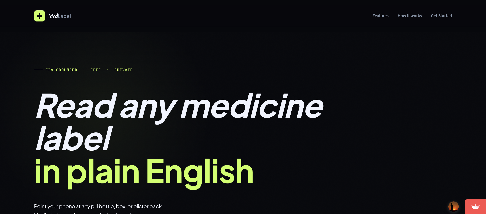
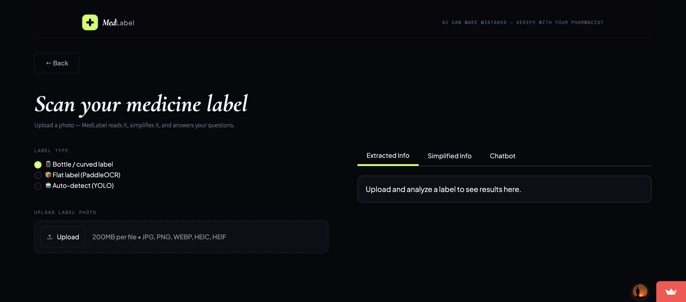

<div align="center">

<!-- ═══════════════════════════════════════════════════════════ HEADER -->

<picture>
  <source media="(prefers-color-scheme: dark)" srcset="docs/screenshots/hero.png">
  
</picture>

<br/>

```
███╗   ███╗███████╗██████╗ ██╗      █████╗ ██████╗ ███████╗██╗
████╗ ████║██╔════╝██╔══██╗██║     ██╔══██╗██╔══██╗██╔════╝██║
██╔████╔██║█████╗  ██║  ██║██║     ███████║██████╔╝█████╗  ██║
██║╚██╔╝██║██╔══╝  ██║  ██║██║     ██╔══██║██╔══██╗██╔══╝  ██║
██║ ╚═╝ ██║███████╗██████╔╝███████╗██║  ██║██████╔╝███████╗███████╗
╚═╝     ╚═╝╚══════╝╚═════╝ ╚══════╝╚═╝  ╚═╝╚═════╝ ╚══════╝╚══════╝
```

### Point your phone at any medicine label. Get plain English answers instantly.

<br/>

[](https://medlabel.streamlit.app/)

<br/>


</div>

<br/>

---

<!-- ═══════════════════════════════════════════════════════════ ABOUT -->

## What is MedLabel?

MedLabel is a full-stack AI system that makes medication information accessible to everyone. Upload a photo of **any medicine packaging** — a pill bottle, cardboard box, blister strip, or prescription label — and MedLabel reads it, simplifies the instructions into plain English, and lets you ask follow-up questions like *"Can I take this with Advil?"* or *"What side effects should I watch for?"*

Every answer is grounded in **official FDA drug label data** — retrieved, ranked, and cited — never hallucinated.

<br/>

---

<!-- ══════════════════════════════════════════════════ APP SCREENSHOT -->

## The App

<div align="center">

<br/>
<sub><i>Scanner view — label type selector, upload panel, and three-tab results panel (Extracted · Simplified · Chatbot)</i></sub>
</div>

<br/>

---

<!-- ═══════════════════════════════════════════════════════ FEATURES -->

## Features

<table>
<tr>
<td width="50%" valign="top">

### 📷 Smart Scanning
YOLO geometry detection classifies each photo as flat or cylindrical, then routes it to the right OCR pipeline automatically. No manual selection required.

### 🔍 Neural Semantic Search
BGE-M3 embeds every query into 1024-dim vectors. A cross-encoder reranker then re-scores the top candidates for precision retrieval over 5,976 FDA chunks.

### 💬 Agentic Chatbot
Three specialized tools handle every question type — dosage lookup, interaction checking, and adverse event queries. Each answer cites its FDA source chunk.

</td>
<td width="50%" valign="top">

### ⚠️ Interaction Checker
Cross-references DDInter + FDA `drug_interactions` sections. Handles drug-drug *and* drug-substance pairs (alcohol, grapefruit, caffeine). Text-scan fallback catches substances not in the drug database.

### 📋 Plain-English Summary
Medical jargon simplified to a 5th-grade reading level. The same label text a pharmacist reads, translated for anyone.

### 🔒 Zero Data Storage
No user data, scans, or queries are ever retained. Every session is fully stateless.

</td>
</tr>
</table>

<br/>

---

<!-- ══════════════════════════════════════════════════ ARCHITECTURE -->

## Architecture

```
                    ┌──────────────────────────────┐
                    │     Any Medicine Photo        │
                    └──────────────┬───────────────┘
                                   │
                                   ▼
                    ┌──────────────────────────────┐
                    │        YOLO v11 Router       │  ← Roboflow-trained
                    │   flat_label / cylindrical   │
                    └──────┬───────────────┬───────┘
                           │               │
              ┌────────────▼──┐       ┌────▼──────────────┐
              │    Path A     │       │      Path B        │
              │  OpenCV +     │       │   Vision API       │
              │  pytesseract  │       │  (curved bottles)  │
              └────────┬──────┘       └────────┬───────────┘
                       └───────────┬───────────┘
                                   │
                                   ▼
                    ┌──────────────────────────────┐
                    │       BGE-M3 Embedding       │  ← 1024-dim vectors
                    │   + Cross-Encoder Reranking  │  ← precision retrieval
                    └──────────────┬───────────────┘
                                   │
               ┌───────────────────┼───────────────────┐
               ▼                   ▼                   ▼
    ┌──────────────────┐ ┌──────────────────┐ ┌──────────────────┐
    │  vector_search   │ │interaction_check │ │  adverse_events  │
    │  Dosage, warnings│ │ DDInter + FDA    │ │  openFDA events  │
    └────────┬─────────┘ └────────┬─────────┘ └────────┬─────────┘
             └───────────────────┬┘──────────────────────┘
                                 │
                                 ▼
                    ┌──────────────────────────────┐
                    │         Streamlit UI         │
                    └──────────────────────────────┘
```

<br/>

---

<!-- ═══════════════════════════════════════════════════ TECH STACK -->

## Tech Stack

<table>
<tr>
<td width="50%" valign="top">

**Vision & OCR**
| Component | Technology |
|---|---|
| Geometry Router | YOLOv11 on Roboflow |
| Flat Labels | pytesseract + OpenCV |
| Curved Bottles | Vision API |
| Image I/O | Pillow + pillow-heif |

</td>
<td width="50%" valign="top">

**Intelligence**
| Component | Technology |
|---|---|
| Embeddings | BGE-M3 (1024-dim) |
| Reranker | Cross-Encoder (ST) |
| Vector Store | ChromaDB |
| Drug IDs | NIH RxNorm API |

</td>
</tr>
<tr>
<td width="50%" valign="top">

**Data Sources**
| Source | Content |
|---|---|
| openFDA Labels | Dosage, warnings, interactions |
| DDInter | Drug-drug interaction pairs |
| openFDA Events | Adverse event reports |
| On-demand | Auto-ingest unknown drugs |

</td>
<td width="50%" valign="top">

**Application**
| Component | Technology |
|---|---|
| Web UI | Streamlit |
| Deployment | Streamlit Cloud |
| OCR (Cloud) | tesseract binary |
| Language | Python 3.10+ |

</td>
</tr>
</table>

<br/>

---

<!-- ═════════════════════════════════════════════════════ CHATBOT -->

## The Chatbot — 3 Specialized Tools

<table>
<tr>
<td align="center" width="33%">

**🔍 vector_search**

Semantic search over FDA label chunks. Handles dosage, warnings, ingredients, and general questions. BGE-M3 retrieves, cross-encoder reranks.

</td>
<td align="center" width="33%">

**⚠️ interaction_check**

Cross-references DDInter + FDA `drug_interactions` sections. Handles drug-drug *and* drug-substance pairs (alcohol, grapefruit, caffeine).

</td>
<td align="center" width="33%">

**🩺 adverse_events**

Pulls the most-reported reactions from openFDA's adverse event database — real-world post-market safety data.

</td>
</tr>
</table>

> **Substance fallback** — Asking *"Can I drink alcohol with this?"* triggers a text-scan over every label chunk for the substance, so nothing slips through even when it's not a named drug in the database.

<br/>

---

<!-- ══════════════════════════════════════════════════════ DATA -->

## The Data

```
ChromaDB
├── 5,976 FDA label chunks  (57+ drugs, BGE-M3 embedded)
├── DDInter interaction pairs  (severity + management)
└── On-demand ingestion  (new drugs auto-fetched from openFDA)

Each chunk:
{
  "drug_name":    "ibuprofen",
  "brand_name":   "Advil",
  "rxcui":        "5640",
  "section_type": "warnings_and_cautions",
  "source":       "fda_label"
}
```

Metadata filtering ensures a question about Advil **only** retrieves Advil chunks — never Tylenol data by accident.

<br/>

---

<!-- ═══════════════════════════════════════════════ QUICK START -->

## Quick Start

```bash
git clone https://github.com/prs-016/MedLabel.git
cd MedLabel

# Full local stack (EasyOCR + all models)
pip install -r requirements-full.txt

# Configure secrets
cp .env.example .env
# → Add XAI_API_KEY, GEMINI_API_KEY, ROBOFLOW_API_KEY

streamlit run app/streamlit_app.py
```

**Lightweight install** (Cloud-compatible, no PyTorch):

```bash
pip install -r requirements.txt
# tesseract binary handled via packages.txt on Streamlit Cloud
```

**Or skip setup entirely →** [medlabel.streamlit.app](https://medlabel.streamlit.app/)

<br/>

---

<!-- ══════════════════════════════════════════════════ SAFETY -->

## Safety

MedLabel is an **informational tool** — not diagnostic, not prescriptive.

- ✅ Answers cite only retrieved FDA data — never hallucinated
- ✅ Requests to exceed labeled doses are refused with the FDA warning
- ✅ Low-confidence OCR reads are flagged visually
- ✅ Zero user data stored — no scans, no queries, no logs

> ⚠️ Always verify with the physical label or your pharmacist. This is not a substitute for professional medical advice.

<br/>

---

<!-- ═══════════════════════════════════════════════ REFERENCES -->

## References

| Resource | Link |
|---|---|
| openFDA Drug Labels | https://open.fda.gov/apis/drug/label/ |
| openFDA Adverse Events | https://open.fda.gov/apis/drug/event/ |
| NIH RxNorm API | https://lhncbc.nlm.nih.gov/RxNav/APIs/RxNormAPIs.html |
| DDInter (Kaggle) | https://www.kaggle.com/datasets/thedevastator/ddinter-dataset-drug-drug-interactions |
| DDInter (Zenodo) | https://zenodo.org/records/5549420 |
| BGE-M3 | https://huggingface.co/BAAI/bge-m3 |
| ChromaDB | https://docs.trychroma.com/ |
| Roboflow | https://roboflow.com/ |

<br/>

---

<div align="center">

[](https://medlabel.streamlit.app/)

<br/>

**Built by the MedLabel team · UC San Diego**

</div>
